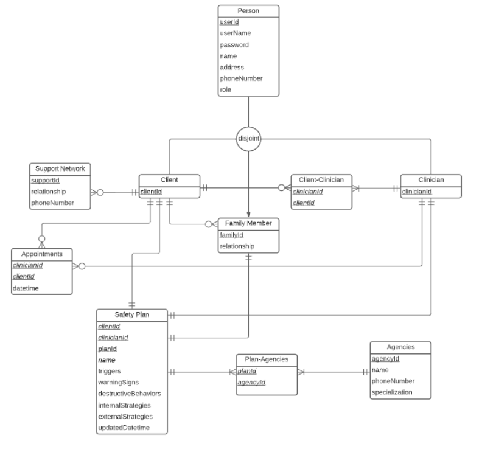
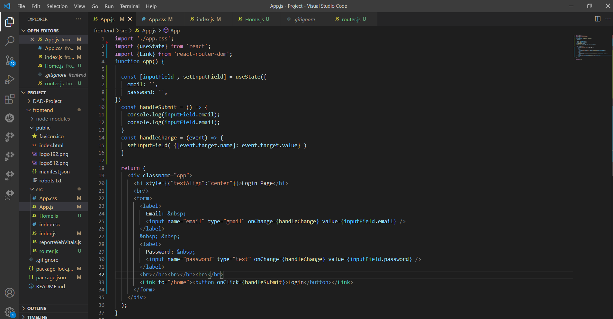
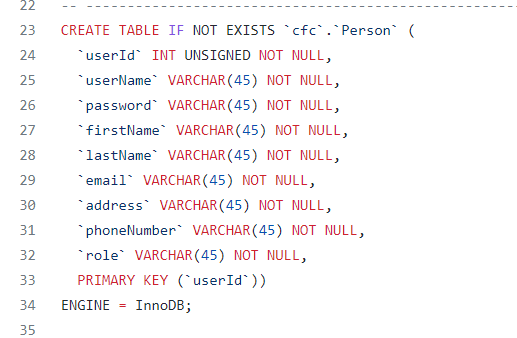
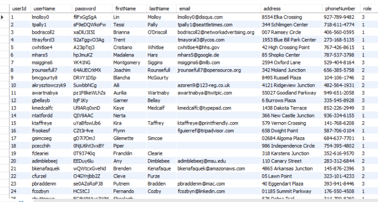

# Development Book

Group 1, ISTE.432.01

Fall 2021

## **Table of Contents**

**[Team Members and Roles:](#_weu71772umyy) 3**

**[Background:](#_vo2jif98s2qt) 3**

**[Project Description:](#_l1s5s8362ac0) 3**

**[Project Requirements:](#_7m8vliial958) 3**

**[Business Rules:](#_lqph00cwewet) 4**

**[Technologies Used:](#_40gpt1hy2irx) 4**

**[Design Pattern:](#_djspdxmuhigd) 4**

**[Entity Relationship Diagram:](#_f8024x3x3c8g) 6**

**[Layering:](#_h6euul65kw8z) 6**

[Presentation Layer:](#_pwtecvufxlbk) 6

[Application Layer:](#_jro7fe4r404t) 7

[Domain Layer:](#_ux9zsma8wy8h) 7

[Infrastructure Layer:](#_wxlgrt3g2u7) 8

**[Timeline:](#_y1cvtguk57xr) 8**

## Team Members and Roles:

- Siddhesh Periaswami, Front-End
- Ezana Kalekristos, Database Administrator
- Ryan Weiss, Back-End
- Afzal Ali, UI/UX Designer

## Background:

Catholic Family Center works to address the barriers preventing people from moving to self-sufficiency in today&#39;s environment. Programs are collaborative and focused on systemic change. Clinicians work with high risk clients to develop a safety plan on paper. That plan is printed and handed to the client or, in the case of phone or Zoom encounters, printed and mailed to the client.The plan, being printed, is not interactive and may easily be lost or destroyed or stored somewhere without ready access by the client.

## Project Description:

The current system involves printing the safety plan for clients on paper and then handing that plan to the clients. If the client is on the phone or over Zoom, then the safety plan is printed and mailed to the client. This is not ideal because it can be easily lost, destroyed, or not easily accessible to the client. In addition, the paper plan is not interactive and thus may not be as helpful as it could. The main goal of this project is to streamline the process of accessing and editing the safety plan using the clinician&#39;s desktop/phone and the client&#39;s phone.

## Project Requirements:

- Safe and secure storage of safety plans uploaded by the clinician.
- Clinicians should be able to copy/paste the plan into another application.
- The application should ask for access to the contact list to get a friend&#39;s phone number for calls
- The users should be presented with choices to create or modify safety plans, and see when a plan was edited and by who.
- The application should have search bar for the users to search for client&#39;s safety plans
- The app should allow both clinician and client to enter and delete items since clients may have trouble typing during phone calls.
- Add resources that the clients can access in the app (help lines, on call clinician)
- Signing up. logging in, and logging out
- The clinician should be able to add a client

## Business Rules:

- You must login before entering details in the application.
- You must be an authorized user of the system to access (Clinician, Client, Family of Client, etc.)
- When a user signs up for the first time, they should fill up their personal information before proceeding with any other steps.
- Only clients and clinicians can create appointments
- The professionals/agencies that we recommend must be verified to be credible before using with clients
- Only a clinician can invite another clinician to support a client
- The date, time and person who edited a safety plan must be recorded
- All users must be able to logout
- Clinicians must be able to to view all clients in the system
- Has to have full functionality on mobile and desktop

## Technologies Used:

**Front-End Technologies:** React, Javascript

**Back-End Technologies:** Go

**Database:** MySQL

**UI/UX:** Figma

## Design Pattern:

We will incorporate the design pattern MVC into our project for various reasons. One reason would be that it can help enforce our business rules within the application. Within the controller, we can create and enable files that will both create and manage the business logic and the functionality for the application. Another reason is that it would allow us to handle different changes/modifications within the application with minimal changes to other sections of the application. The MVC pattern supports loose coupling, and since we are anticipating later refactoring to code, it will help significantly later in the timeline. This pattern also aids with support for multiple views. Due to the fact that the CFC project is intended to have support for both the Desktop and mobile devices, MVC will allow us to have two different views without needing to adjust the controller or the model at all.

Model: Solely responsible for interacting with the database and handling all data logic. It creates, retrieves, updates, and deletes any data from the database. The Model only communicates with the controller and provides it with whatever information the controller needs.

View: The frontend graphical user interface that the user interacts with. The View only communicates with the controller. The View is used to display the data using the Model object.

Controller: The intermediary between the View and Model. It requests information from the Model and sends it to the View, or it can get information from the View and send it to the Model. This will handle all of the logic for the business rules.

## Entity Relationship Diagram:

## Layering:

## Presentation Layer

- Responsible for formatting and displaying the information of the application. This layer is also responsible for collecting information from the users.
- This layer acts as the user interface of the application where the users interact with the applications. The client and clinician will interact with this layer to communicate with the application.
- This layer will also act as the &quot;View&quot; in our MVC architecture
- Clients will cread, read, update, and delete their warning signs, internal and external coping strategies, emergency contacts, and request immediate help.
- Clinicians would be able to view their clients safety plans and would be notified of any changes the clients make.
- Users(Clients/Clinicians) will be using the UI to login to their respective accounts.

The code snippet above shows how the login page is designed. It shows the structure(1 Column) of the login page and the components(Labels, Input Text Fields, Button) of it. The code also shows how these Input Fields are stored in values(React Hook States) and how they can be used while the user hits the submit button. Also one other thing to notice here is that, the user is redirected to the Home page after hitting the login button. The user will be able to view the Safety Plan on the Home page.

## Application Layer

- This layer contains the data layer which is responsible for storing and managing the data
- All the data is stored and maintained in a relational database server like MySQL, PostgreSQL or a non relational database like MongoDB, Cassandra
- Data which is stored in Database includes:
  - User details like the username/email, email, password, name, address phone number will be stored in a table in the database.

In the image above we can see how the table in the database is defined, what are all the column names/attributes defined in the table.

  - Other Safety Plan related information like Name, Triggers, Warning Signs, Destructive Behaviors, Internal Coping Strategies External Coping Strategies is stored in a table in the database

## Infrastructure Layer

- The DAOs , which will interact with the Facades to load data from the database. This is how the Application layer will communicate with the database. This will be written in Go. There isn&#39;t any code yet because we were focused on getting the database created first.
  - ClientDAO, which will interact with the ClientFacade. This DAO will add/update the client table, as well as return user information, appointments, support networks, and plans.
  - ClinicianDAO, which will interact with the ClinicianFacade. This DAO will add/update clinician information, as well as return clients, plans, and appointments.
  - PlanDAO, which will interact with the PlanFacade. This DAO will add/update plans, return plans, and return agencies associated with the plan.
  - UserDAO, which will interact with the UserFacade. This DAO will add/update users.
  - FamilyDAO, which will interact with the FamilyFacade. This DAO will add/update family information, as well as return plans and clients.
- The facades, which will be interacting directly with the database. These facades will handle the sql statements, and will return the data to the DAOs. Each DAO will have its own facade. The facades will also be written in Go.
- The MYSQL Database.
  - DBConnection is the class used to instantiate the database connection. Every facade will use the DBConnection object to connect.
  - A few inconsistencies in the data are &quot;blanks&quot; rows in some of the &quot;last names&quot; and &quot;email&quot; columns. 

## Timeline:

- Milestone3 (Layering) - October 8, 2021
- Milestone4 (ExceptionHandling) - October 22, 2021
- Milestone5 (Refactoring) - November 5, 2021
- Milestone6 (Testing) - November 19, 2021
- Milestone7 (Packaging) - November 29, 2021
- Finalized Project Code - December 6, 2021